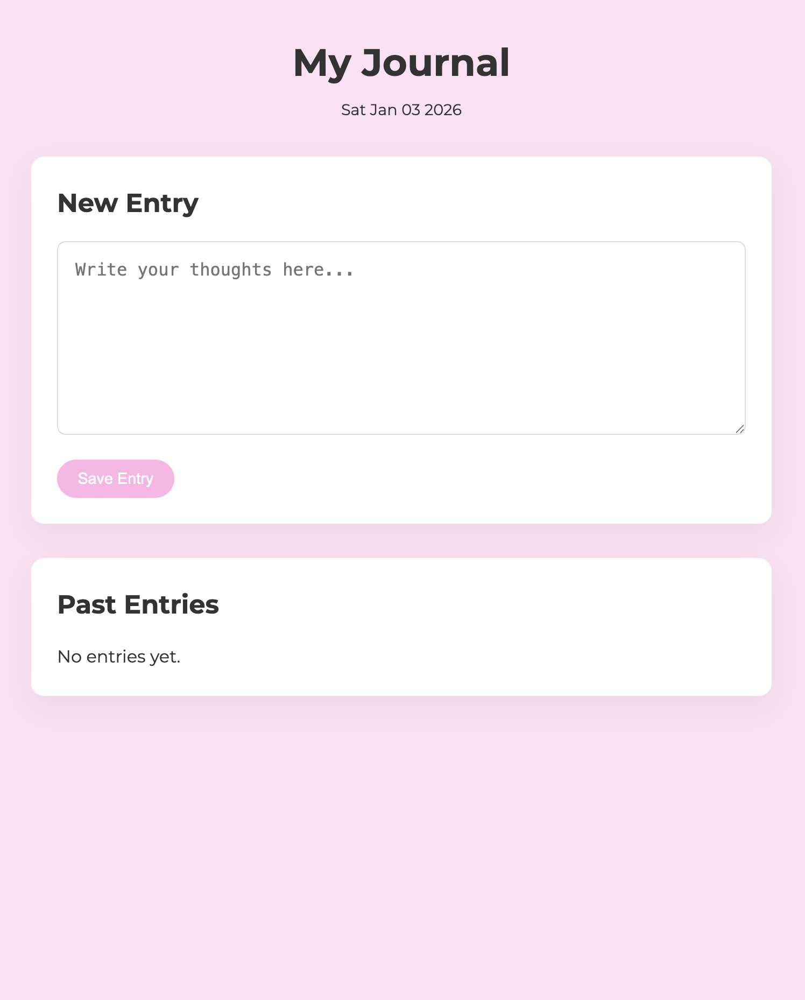

# Personal Journal

A minimal static personal journal web application.

This project is a fully client-side journaling app developed with plain HTML, CSS, and JavaScript, demonstrating core front-end fundamentals. It includes:

- `index.html` — Main Page
- `style.css` — Styles
- `script.js` — App Logic
- `screenshots/` — Example Screenshots

## Run Locally

1. Clone The Repository:

```
git clone https://github.com/Ruaa-A01/Personal-Journal.git
cd Personal-Journal
```

2. Open The App In Your Browser:

- Double-Click `index.html` To Open It In Your Default Browser.

OR Start A Simple HTTP Server (recommended for some browser features):

```bash
python3 -m http.server 8000
# Then Open http://localhost:8000 In Your Browser
```

## Features

- Static single-page app using `index.html`, `script.js`, & `style.css`.
- View the example screenshot of the project below.

### Personal Journal Image


---

“Today’s practice becomes tomorrow’s expertise.” ♥︎
